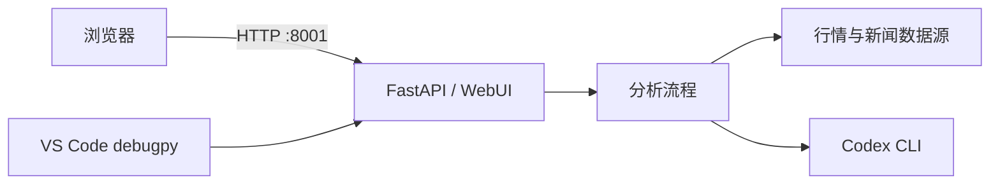

# 本地部署与断点调试

本文说明如何在 Linux/macOS 开发环境中部署 DSA、使用 Codex 作为生成后端，并通过 VS Code 在 `8001` 端口进行 Python 断点调试。



## 1. 环境准备

**小结：** 准备 Python 3.11、项目依赖和本地环境变量。

```bash
cd /opt/tiger/daily_stock_analysis
python --version
pip install -r requirements.txt
cp .env.example .env
```

`.env` 包含密钥和本机配置，不应提交到 Git。至少配置一个可用的模型后端，并按需配置股票列表、行情源和通知渠道。

本地 Web 服务使用 `8001` 时：

```env
WEBUI_HOST=0.0.0.0
WEBUI_PORT=8001
```

## 2. Codex 后端

**小结：** 普通分析使用 `codex_cli`，问股 Chat 使用 `codex_app_server`。

先确认 Codex 已安装并登录：

```bash
codex --version
codex login status
```

推荐配置：

```env
GENERATION_BACKEND=codex_cli
GENERATION_FALLBACK_BACKEND=codex_cli
GENERATION_BACKEND_TIMEOUT_SECONDS=300
GENERATION_BACKEND_MAX_CONCURRENCY=1
LOCAL_CLI_BACKEND_MAX_CONCURRENCY=1

AGENT_BACKEND=codex_app_server
AGENT_ARCH=single
AGENT_ORCHESTRATOR_TIMEOUT_S=300
```

如果交互式 Codex 与 DSA 并行运行时出现 `database is locked`，可为 DSA 设置独立状态目录。配置和登录文件仍可链接到原 Codex 目录：

```bash
install -d -m 700 "$HOME/.codex-dsa"
ln -s "$HOME/.codex/config.toml" "$HOME/.codex-dsa/config.toml"
ln -s "$HOME/.codex/auth.json" "$HOME/.codex-dsa/auth.json"
```

然后在 `.env` 中增加：

```env
CODEX_HOME=/home/your-user/.codex-dsa
```

不要将真实用户名、Token 或 `auth.json` 提交到仓库。

## 3. 本地部署

**小结：** `--serve-only` 只启动 Web/API，不会在启动时自动执行分析。

```bash
python main.py --serve-only --host 0.0.0.0 --port 8001
```

访问地址：

- WebUI：`http://127.0.0.1:8001`
- Swagger：`http://127.0.0.1:8001/docs`
- 健康检查：`http://127.0.0.1:8001/api/health`

验证：

```bash
curl --noproxy '*' http://127.0.0.1:8001/api/health
```

若本机设置了 HTTP 代理，建议保留 `--noproxy '*'`，避免 localhost 请求被代理转发。

## 4. VS Code 断点调试

**小结：** 使用仓库中的 `.vscode/launch.json` 启动 `main.py --serve-only`。

当前调试配置等价于：

```json
{
  "version": "0.2.0",
  "configurations": [
    {
      "name": "Python: Web API (8001)",
      "type": "debugpy",
      "request": "launch",
      "python": "/usr/bin/python",
      "program": "${workspaceFolder}/main.py",
      "args": ["--serve-only", "--host", "0.0.0.0", "--port", "8001"],
      "cwd": "${workspaceFolder}",
      "envFile": "${workspaceFolder}/.env",
      "console": "integratedTerminal",
      "justMyCode": true,
      "subProcess": true
    }
  ]
}
```

调试步骤：

1. 确认 `8001` 没有被普通服务占用。
2. 确认调试配置使用 `/usr/bin/python`；项目内空的 `.venv` 可能缺少依赖。
3. 在目标 Python 行左侧设置断点。
4. 打开 VS Code“运行和调试”。
5. 选择 `Python: Web API (8001)`，按 `F5`。
6. 在 WebUI 执行对应操作，或通过 Swagger/curl 调用接口。

查找并停止占用端口的进程：

```bash
ss -ltnp 'sport = :8001'
kill -TERM <PID>
```

## 5. 验证 Codex

**小结：** “可用”只表示找到了 CLI；JSON 冒烟测试成功才表示真实生成链路可用。

WebUI 路径：

1. 打开“设置”。
2. 找到“生成后端状态”。
3. 点击“JSON 冒烟测试”。
4. 确认显示“生成后端冒烟测试通过”。

也可直接调用 API：

```bash
curl --noproxy '*' \
  -H 'Content-Type: application/json' \
  -d '{"backend_id":"codex_cli","mode":"json","timeout_seconds":60}' \
  http://127.0.0.1:8001/api/v1/system/config/generation-backends/smoke-test
```

成功响应的关键字段：

```json
{
  "success": true,
  "status": {
    "backend_id": "codex_cli",
    "health_status": "passed"
  }
}
```

## 6. Docker 部署

**小结：** Docker 默认使用 `API_PORT=8000`；需要 `8001` 时在启动前覆盖该变量。

```bash
API_PORT=8001 docker compose -f docker/docker-compose.yml up -d --build server
docker compose -f docker/docker-compose.yml ps
docker compose -f docker/docker-compose.yml logs -f server
```

停止服务：

```bash
docker compose -f docker/docker-compose.yml down
```

本地 Codex CLI 登录态不会自动进入容器。若容器内使用 `codex_cli` 或 `codex_app_server`，必须在容器运行环境中单独安装 Codex、提供登录态并妥善挂载 `CODEX_HOME`；否则建议使用 `litellm`。

## 7. 常见问题

**小结：** 优先检查端口、解释器、环境变量、Codex 登录态和运行日志。

| 现象 | 检查方式 | 处理 |
| --- | --- | --- |
| `port is not available` | `ss -ltnp 'sport = :8001'` | 停止占用进程或更换端口 |
| 断点不命中 | 检查是否由 VS Code 的调试配置启动 | 停止普通服务后重新按 `F5` |
| 页面打不开 | 调用 `/api/health` | 检查监听地址、防火墙和启动日志 |
| localhost 返回代理错误 | 检查 `HTTP_PROXY` / `NO_PROXY` | curl 使用 `--noproxy '*'`，或把 localhost 加入 `NO_PROXY` |
| Codex 显示可用但请求失败 | 运行 JSON 冒烟测试 | 检查登录、模型、网络、超时及 `CODEX_HOME` |
| Codex 报数据库锁 | 检查是否有多个 Codex 进程共享状态目录 | 为 DSA 配置独立 `CODEX_HOME` |

后端日志默认位于 `logs/`。需要更详细日志时，可将 `.env` 中的 `LOG_LEVEL` 和 `DEBUG` 临时改为：

```env
LOG_LEVEL=DEBUG
DEBUG=true
```

问题定位完成后应恢复常规日志级别，避免长期产生大量调试日志。
